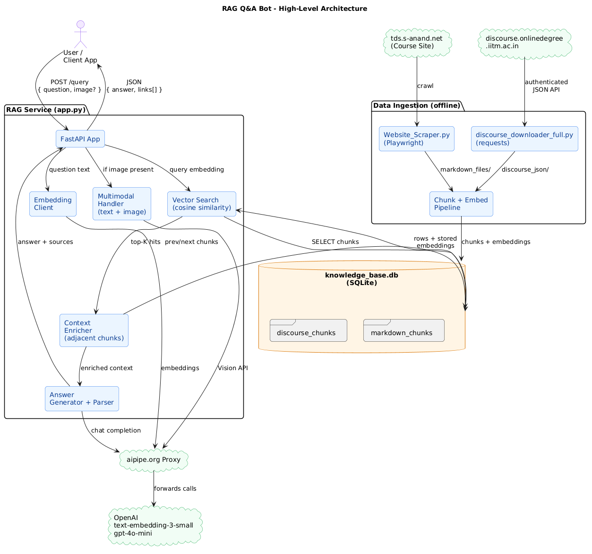
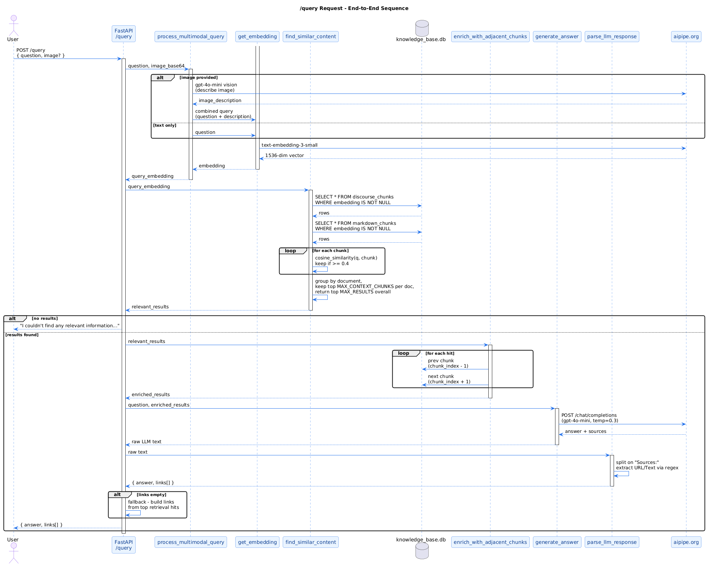
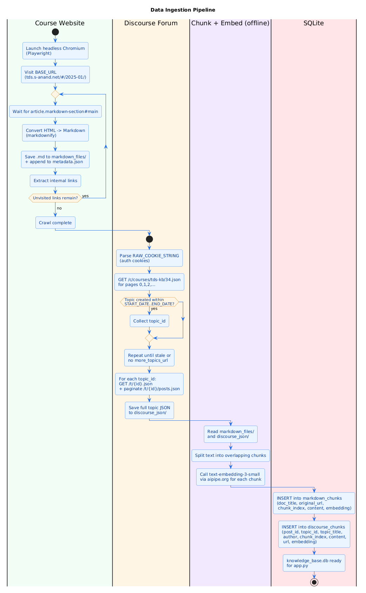
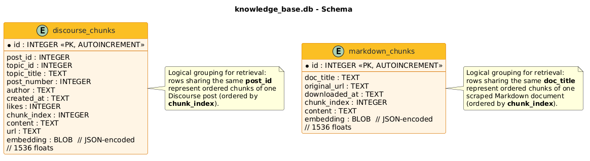

# RAG Q&A Bot

A multimodal Retrieval-Augmented Generation service that answers questions about the IIT Madras **Tools in Data Science (TDS)** course. It retrieves grounded context from the course website and the course Discourse forum, then asks an LLM to compose an answer with cited source URLs. Accepts an optional image alongside the question.

The service is a single FastAPI app ([app.py](app.py)) backed by a pre-built SQLite knowledge base ([knowledge_base.db](knowledge_base.db)) that contains text chunks plus their `text-embedding-3-small` vectors. Two scrapers ([Website_Scraper.py](Website_Scraper.py), [discourse_downloader_full.py](discourse_downloader_full.py)) collect the raw source material that feeds that knowledge base.

---

## Table of contents

- [Features](#features)
- [Architecture](#architecture)
- [Tech stack](#tech-stack)
- [Repository layout](#repository-layout)
- [Quickstart](#quickstart)
- [API reference](#api-reference)
- [How a query is answered](#how-a-query-is-answered)
- [Data ingestion pipeline](#data-ingestion-pipeline)
- [Database schema](#database-schema)
- [Configuration](#configuration)
- [Notes & limitations](#notes--limitations)
- [License](#license)

---

## Features

- **Grounded answers with citations** — the LLM is constrained to answer only from retrieved chunks and to return source URLs in a strict format.
- **Hybrid knowledge base** — combines official course Markdown pages and student/instructor Discourse threads.
- **Multimodal queries** — optional base64 image is described by `gpt-4o-mini` Vision and folded into the text query before retrieval.
- **Cosine-similarity retrieval over SQLite** — embeddings are stored as JSON blobs; similarity is computed in-process with NumPy. No external vector DB required.
- **Context window enrichment** — for each top hit, the previous and next chunks of the same document are appended to give the LLM more context.
- **Per-document grouping** — top-K results are grouped by source document so a single chatty thread can't crowd out other sources.
- **Resilient external calls** — retries with exponential backoff on rate limits for both embeddings and completions.
- **Health endpoint** — `/health` reports DB connectivity, chunk counts, and whether the API key is set.
- **CORS open by default** — easy to wire into any front-end.

---

## Architecture



The repo cleanly separates **offline data ingestion** from the **online RAG service**:

| Layer | What it does | Files |
|---|---|---|
| Scrapers | Crawl the course site and the Discourse forum into local files | [Website_Scraper.py](Website_Scraper.py), [discourse_downloader_full.py](discourse_downloader_full.py) |
| Knowledge base | SQLite store of chunks + embeddings | [knowledge_base.db](knowledge_base.db) |
| API | Retrieval, enrichment, generation, response shaping | [app.py](app.py) |
| External | Embedding + chat + vision via the `aipipe.org` OpenAI proxy | `aipipe.org` → OpenAI |

> PlantUML sources for every diagram in this README live under [docs/diagrams/](docs/diagrams/). You can regenerate the PNGs at any time with `python docs/diagrams/_render.py` (uses the public PlantUML server).

---

## Tech stack

- **Python 3.10+**
- **FastAPI** + **Uvicorn** — HTTP server
- **SQLite** (stdlib `sqlite3`) — vector + metadata storage
- **NumPy** — cosine similarity
- **aiohttp** — async calls to the LLM/embedding proxy
- **Playwright** (Chromium) — JS-rendered course site crawler
- **requests** — Discourse JSON API client
- **markdownify** — HTML → Markdown for scraped pages
- **python-dotenv** — `.env` loading
- **OpenAI models via [aipipe.org](https://aipipe.org)** — `text-embedding-3-small` for vectors, `gpt-4o-mini` for chat and vision

---

## Repository layout

```
.
├── app.py                        # FastAPI RAG service (/query, /health)
├── Website_Scraper.py            # Playwright crawler for tds.s-anand.net
├── discourse_downloader_full.py  # Discourse forum JSON downloader
├── knowledge_base.db             # SQLite KB (chunks + embeddings)
├── requirements.txt              # Python dependencies
├── scripts/
│   └── download-db.sh            # Pulls knowledge_base.db from GitHub Releases
├── docs/
│   └── diagrams/                 # PlantUML sources + rendered PNGs
│       ├── architecture.puml / .png
│       ├── query_sequence.puml / .png
│       ├── ingestion_flow.puml / .png
│       ├── schema.puml / .png
│       └── _render.py            # Renders *.puml -> *.png via plantuml.com
├── LICENSE                       # MIT
└── README.md
```

---

## Quickstart

### 1. Prerequisites

- Python 3.10 or newer
- An API key accepted by the [aipipe.org](https://aipipe.org) OpenAI proxy (used for both embeddings and chat completions)
- `bash` + `curl` (for the DB download script), or just download `knowledge_base.db` manually

### 2. Install

```bash
git clone <your-fork-url> rag-qa-bot
cd rag-qa-bot
python -m venv .venv
# Windows:  .venv\Scripts\activate
# Unix:     source .venv/bin/activate
pip install -r requirements.txt
```

### 3. Get the knowledge base

The repo ships with [knowledge_base.db](knowledge_base.db). If it's missing (or you want the canonical copy from the release), run:

```bash
bash scripts/download-db.sh
```

This downloads the prebuilt SQLite KB from the project's GitHub release into the working directory.

### 4. Configure your API key

Create a `.env` file in the project root:

```env
API_KEY=your-aipipe-or-openai-key-here
```

`app.py` will load it on startup via `python-dotenv`. The same key is sent in the `Authorization` header to both `https://aipipe.org/openai/v1/embeddings` and `https://aipipe.org/openai/v1/chat/completions`.

### 5. Run the API

```bash
python app.py
# or, equivalently:
uvicorn app:app --host 0.0.0.0 --port 8000 --reload
```

The server starts on `http://localhost:8000`. Interactive OpenAPI docs are at `http://localhost:8000/docs`.

### 6. Smoke test

```bash
curl -s http://localhost:8000/health | python -m json.tool

curl -s -X POST http://localhost:8000/query \
  -H "Content-Type: application/json" \
  -d '{"question": "How are graded assignments scored in TDS?"}' \
  | python -m json.tool
```

---

## API reference

### `POST /query`

Ask a question against the knowledge base. The `image` field is optional and must be raw base64 (no `data:` prefix) — it will be described by GPT-4o-mini Vision and folded into the query before embedding.

**Request body**

```json
{
  "question": "string",
  "image": "base64-encoded image (optional)"
}
```

**Response — 200 OK**

```json
{
  "answer": "string",
  "links": [
    { "url": "https://...", "text": "brief quote or description" }
  ]
}
```

If no chunk passes the similarity threshold, the API returns:

```json
{ "answer": "I couldn't find any relevant information in my knowledge base.", "links": [] }
```

### `GET /health`

Returns DB connectivity, chunk counts, embedding coverage, and whether `API_KEY` is set. Useful for liveness/readiness probes.

```json
{
  "status": "healthy",
  "database": "connected",
  "api_key_set": true,
  "discourse_chunks": 12345,
  "markdown_chunks": 678,
  "discourse_embeddings": 12345,
  "markdown_embeddings": 678
}
```

---

## How a query is answered



Walking through [app.py](app.py):

1. **Receive** — `query_knowledge_base` validates that `API_KEY` is set and opens a per-request SQLite connection.
2. **(Optional) image fusion** — if `image` is present, [`process_multimodal_query`](app.py) sends it to GPT-4o-mini Vision, takes the textual description, and concatenates it with the original question.
3. **Embed** — [`get_embedding`](app.py) calls `text-embedding-3-small` via the proxy (with retries + exponential backoff on HTTP 429).
4. **Retrieve** — [`find_similar_content`](app.py) loads every row that has an embedding from both tables, computes [`cosine_similarity`](app.py) against the query vector, keeps anything above `SIMILARITY_THRESHOLD = 0.4`, then **groups results by source document** and keeps the top `MAX_CONTEXT_CHUNKS = 4` per document, finally returning the global top `MAX_RESULTS = 10`.
5. **Enrich** — [`enrich_with_adjacent_chunks`](app.py) appends the previous and next `chunk_index` of each hit so the LLM sees a wider window of context.
6. **Generate** — [`generate_answer`](app.py) sends a strict prompt to `gpt-4o-mini` at `temperature=0.3` instructing it to (a) answer only from context, (b) use whole-number "hundreds format" for marks (e.g. `11/10` → `110`), and (c) emit a `Sources:` section with exact URLs.
7. **Parse** — [`parse_llm_response`](app.py) splits on `Sources:` (with fallbacks for `Source:`, `References:`, `Reference:`) and extracts `{url, text}` pairs with a permissive regex.
8. **Fallback links** — if the parser couldn't extract any URLs, the API returns links built directly from the top retrieval hits so the client always gets citations.
9. **Respond** — `{ answer, links[] }` is returned and the DB connection is closed in `finally`.

---

## Data ingestion pipeline



There are two independent collectors. Neither chunking nor embedding code is included in this repo — the bundled [knowledge_base.db](knowledge_base.db) is the shipped artifact of that offline step.

### Course website — [Website_Scraper.py](Website_Scraper.py)

- Launches headless Chromium via Playwright and starts at `BASE_URL = https://tds.s-anand.net/#/2025-01/`.
- Waits for `article.markdown-section#main`, grabs its inner HTML, converts to Markdown with `markdownify`, and writes one `.md` file per page to `markdown_files/`.
- Each file gets a YAML front-matter block (`title`, `original_url`, `downloaded_at`).
- Recursively follows every internal `/#/` link found on each page until the visited set is exhausted.
- All page metadata is also appended to `metadata.json`.

Run:

```bash
python -m playwright install chromium  # one-time
python Website_Scraper.py
```

### Discourse forum — [discourse_downloader_full.py](discourse_downloader_full.py)

- Paginates `GET /c/courses/tds-kb/34.json` to enumerate topic IDs in category **34 (`courses/tds-kb`)**.
- Filters topics by `created_at` within `START_DATE` … `END_DATE` (defaults: 2024-10-01 → 2025-04-15).
- Has a staleness guard: if `MAX_CONSECUTIVE_PAGES_WITHOUT_NEW_TOPICS = 5` pages pass without a new unique topic, listing stops.
- For each topic, fetches `/t/{id}.json` then batches `/t/{id}/posts.json?post_ids[]=…` (50 per request) to load any posts not present in the initial page.
- Writes one `discourse_json/topic_{id}.json` per topic, with posts re-sorted to the original stream order.

Auth: requires `RAW_COOKIE_STRING` (logged-in browser cookies for `discourse.onlinedegree.iitm.ac.in`). Update the constant at the top of the file before running.

---

## Database schema



`knowledge_base.db` is a single-file SQLite database with two tables. Both are created by `app.py` on first launch if missing.

- **`discourse_chunks`** — one row per chunk of a Discourse post. The `(post_id, chunk_index)` pair is what `enrich_with_adjacent_chunks` uses to fetch neighboring chunks.
- **`markdown_chunks`** — one row per chunk of a scraped Markdown document. Neighboring chunks are looked up by `(doc_title, chunk_index)`.

Both tables store the embedding column as a `BLOB` containing a **JSON-encoded list of floats** (decoded via `json.loads` at query time). Vectors are 1536-dim (`text-embedding-3-small`).

---

## Configuration

These constants at the top of [app.py](app.py) shape retrieval behavior:

| Constant | Default | Effect |
|---|---:|---|
| `DB_PATH` | `knowledge_base.db` | SQLite file location |
| `SIMILARITY_THRESHOLD` | `0.4` | Minimum cosine similarity for a chunk to be considered relevant |
| `MAX_RESULTS` | `10` | Hard cap on chunks passed to the LLM after grouping |
| `MAX_CONTEXT_CHUNKS` | `4` | Per-document cap so one chatty source can't dominate context |

Environment:

- `API_KEY` — passed verbatim in the `Authorization` header for embedding, chat, and vision calls via `aipipe.org`.

---

## Notes & limitations

- **The shipped DB is the only ingestion artifact in the repo.** Chunking and embedding code (text splitter, embedding loop, INSERT pipeline) are not included here; the scrapers produce the *raw* files (`markdown_files/`, `discourse_json/`), and the prebuilt `knowledge_base.db` is the downstream artifact. To rebuild from scratch you'd need to add a chunk-and-embed step that writes into the same schema.
- **Discourse cookies are sensitive.** [discourse_downloader_full.py](discourse_downloader_full.py) currently hardcodes a `RAW_COOKIE_STRING`. Replace it with your own and **do not commit real cookies** to a public repo.
- **Cosine similarity is computed in Python for every row.** That's fine for a few thousand chunks but will not scale to millions — at that point swap in a real vector index (FAISS, sqlite-vec, pgvector, etc.).
- **CORS is wide open** (`allow_origins=["*"]`). Tighten this for production.
- **`requirements.txt` does not pin versions and does not list Playwright or `markdownify`.** Install those explicitly if you intend to run the scrapers:
  ```bash
  pip install playwright markdownify requests
  python -m playwright install chromium
  ```
- **The answer prompt enforces a course-specific format** (marks rendered as 100, 110, etc. instead of fractions). If you reuse this code for another domain, edit the prompt in `generate_answer` accordingly.

---

## License

MIT — see [LICENSE](LICENSE). © 2024 Henil Diwan.
